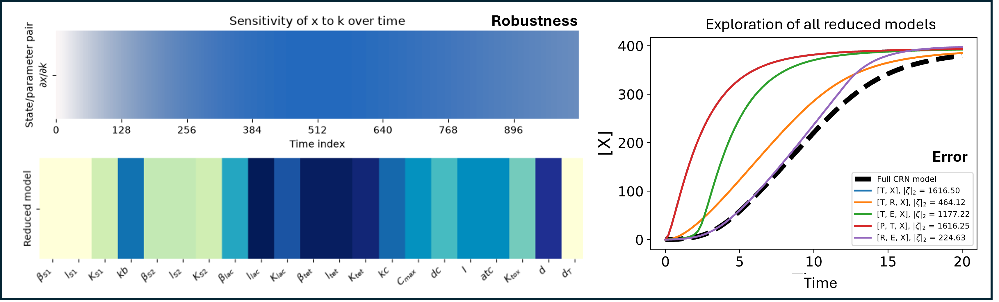

# AutoReduce: An Automated Model Reduction Toolbox



Python toolbox to obtain reduced model expressions using time-scale
separation, conservation laws, sensitivity analysis, and projection-based
interfaces to established reduction libraries.

[](https://github.com/ayush9pandey/autoreduce/actions/workflows/build.yml)
[](https://badge.fury.io/py/autoreduce)
[](https://autoreduce.readthedocs.io/en/latest/?badge=latest)

## Overview

AutoReduce is a Python package for automated model reduction of nonlinear
dynamical systems. It provides tools for:

- Automated model reduction using QSSA (Quasi-Steady State Approximation)
- Conservation-law based reductions
- Local sensitivity analysis
- SBML import/export through python-libsbml
- Integration with [BioCRNPyler](https://biocrnpyler.readthedocs.io/) for synthetic biology models
- Optional python-control and PyDMD interfaces

See the [bioRxiv paper](https://doi.org/10.1101/2020.02.15.950840)
and [International Journal of Robust and Nonlinear Control paper](https://doi.org/10.1002/rnc.6013)
for the model-reduction background.

## Quick Start

```python
import numpy as np
from sympy import symbols

from autoreduce import System, solve_timescale_separation

S, C, P, k1, k2, k3, E_total = symbols("S C P k1 k2 k3 E_total")

E = E_total - C
x = [S, C, P]
f = [
    -k1 * E * S + k2 * C,
    k1 * E * S - (k2 + k3) * C,
    k3 * C,
]

system = System(
    x,
    f,
    params_dict={k1: 1.0, k2: 0.5, k3: 0.25, E_total: 1.0},
    x_init=[10.0, 0.0, 0.0],
    C=np.array([[1, 0, 0], [0, 0, 1]]),
)

reduced_system, collapsed_system = solve_timescale_separation(
    system,
    [S, P],
    fast_states=[C],
)
```

`params_dict` can be used to set, get, and update parameters:

```python
system.set_param(k1, 2.0)
system.get_param(k1)
system.set_param_dict({k2: 1.0, k3: 0.1})
```

For more examples, check out the [documentation](https://autoreduce.readthedocs.io/en/latest/examples.html).

## Installation

Supported Python versions are 3.9 - 3.13.

Install the latest version of AutoReduce:

```bash
pip install autoreduce
```

Install with all optional dependencies:

```bash
pip install autoreduce[all]
```

Install optional integrations explicitly:

```bash
pip install "autoreduce[bio]"
pip install "autoreduce[control]"
pip install "autoreduce[dmd]"
```

For development installation:

```bash
git clone https://github.com/ayush9pandey/autoreduce.git
cd autoreduce
pip install -e ".[dev]"
```

## Documentation

Full documentation is available at [autoreduce.readthedocs.io](https://autoreduce.readthedocs.io/).

## Contributing

We welcome contributions. Developer notes and release instructions are in the
[documentation](https://autoreduce.readthedocs.io/en/latest/develop.html).

## Contact

For questions, feedback, or suggestions, please contact:
- Ayush Pandey (ayushpandey at ucmerced dot edu)
- [GitHub Issues](https://github.com/ayush9pandey/autoreduce/issues)

## License

Released under the BSD 3-Clause License (see `LICENSE`)
